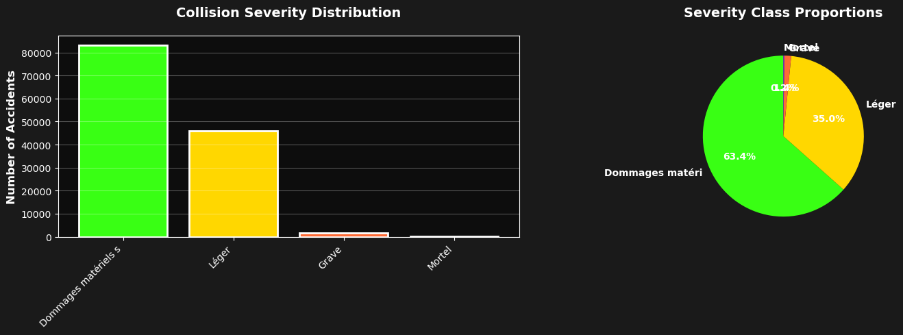
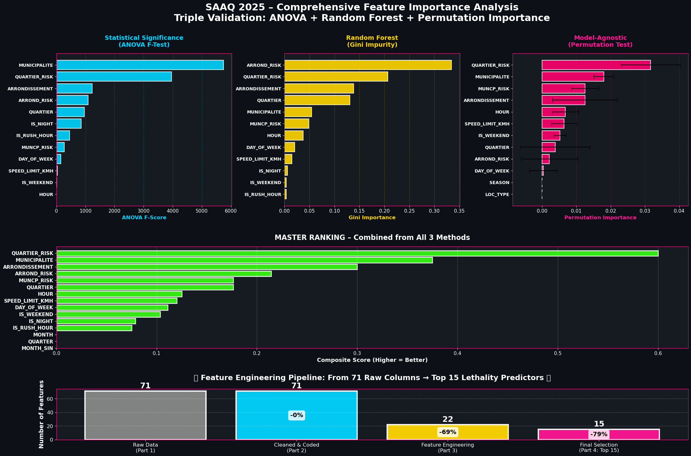
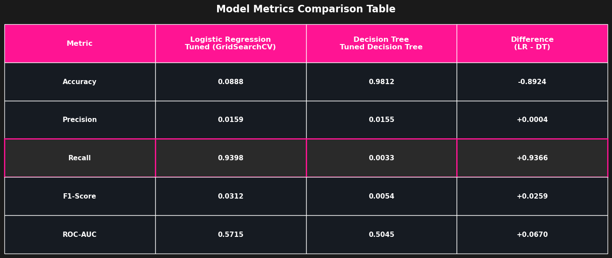
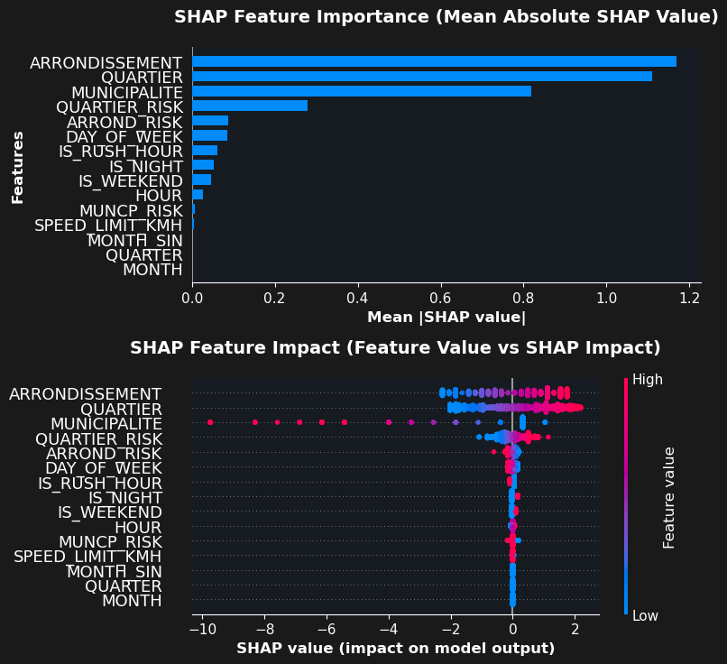
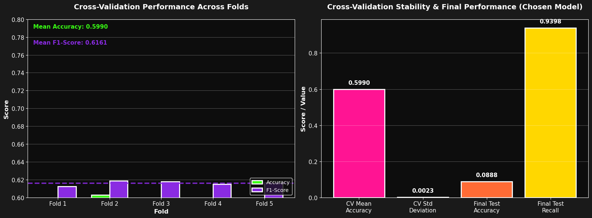
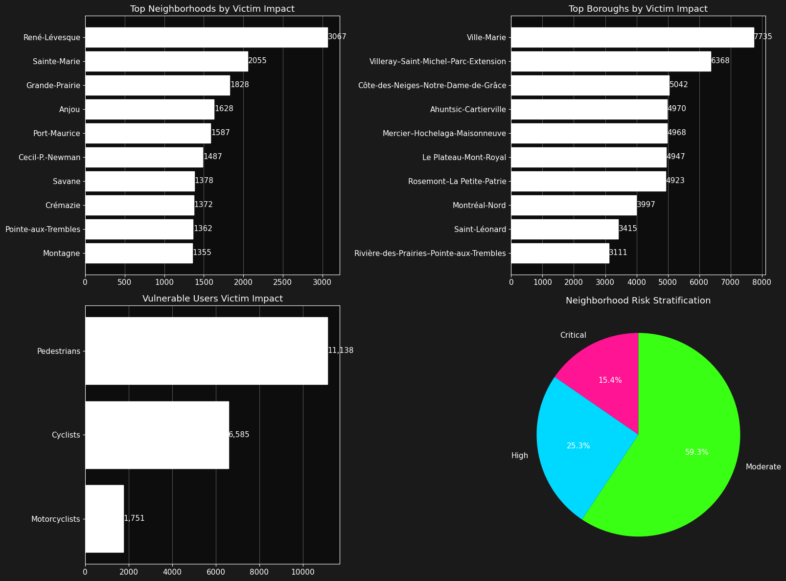
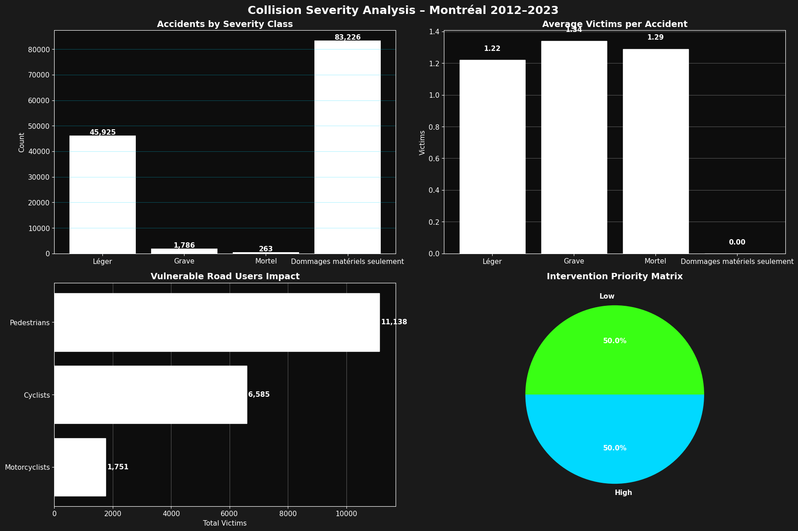
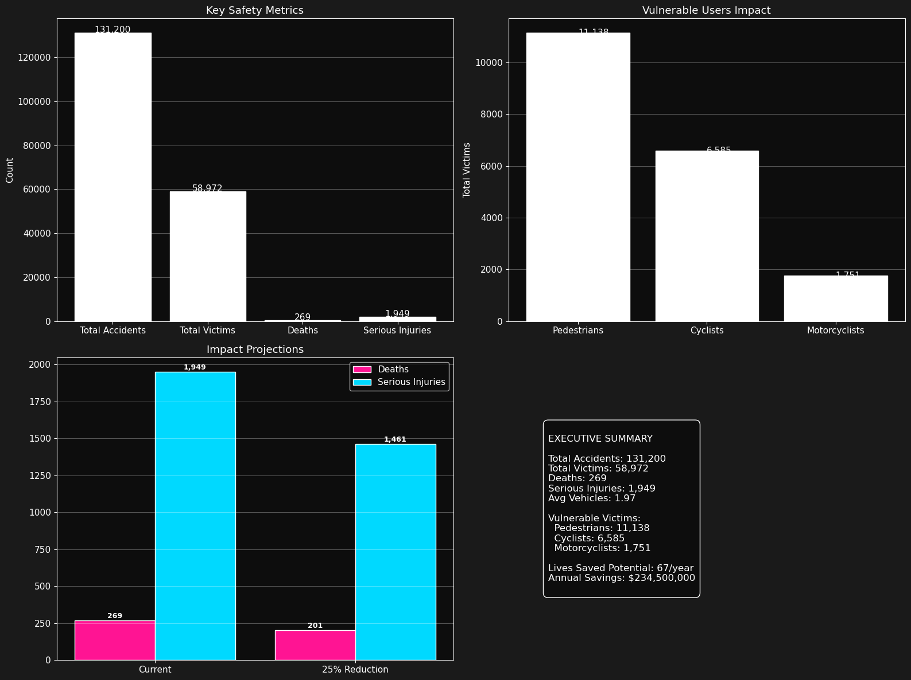

# Montreal Crash Risk (Machine Learning Portfolio Project)

## Problem Statement
Montréal road collisions are heavily imbalanced: severe/fatal crashes are rare but high impact. This project asks a practical policy question:

**How can we identify high-risk crash situations early enough to prioritize prevention resources and reduce severe outcomes?**

## Executive Summary (Non-Technical)
Using historical collision data and a recall-first machine learning approach, the project focuses on catching as many severe/fatal situations as possible, even when those events are uncommon. The selected model (tuned Logistic Regression) achieved **0.9398 recall** on the severe/fatal class in notebook evaluation outputs. This means the approach can be used as an early-warning prioritization tool for where/when to intervene, then paired with engineering and enforcement actions.

More detail: `docs/executive_summary.md`

## Outcome and Insights
- Severe/fatal events in the modeling dataset: **2,049 (1.5617%)**.
- Final selected model: **Logistic Regression (Tuned GridSearchCV)**.
- Final selected metrics (from executed notebook outputs):
  - Accuracy: **0.0888**
  - Precision: **0.0159**
  - Recall: **0.9398**
  - F1-score: **0.0312**
  - ROC-AUC: **0.5715**
- Cross-validation summary (notebook outputs):
  - Accuracy: **0.5990 ± 0.0023**
  - Precision: **0.5909 ± 0.0023**
  - Recall: **0.6436 ± 0.0030**
  - F1-score: **0.6161 ± 0.0021**

Parsed outputs are saved in:
- `results/metrics_summary.json`
- `results/model_comparison.csv`

## ML Workflow

```mermaid
flowchart LR
A[Raw Collision Data] --> B[Data Cleaning and Leakage Prevention]
B --> C[Feature Engineering]
C --> D[Class Imbalance Handling - SMOTENC]
D --> E[Feature Selection - ANOVA + RF + Permutation]
E --> F[Model Training - LR, DT, RF, XGB]
F --> G[Hyperparameter Tuning]
G --> H[Recall-Driven Model Selection]
H --> I[Geographic Risk and Policy Recommendations]
```


Technical detail: `docs/methodology.md`

## Visuals
### Key Portfolio Figures









### Full Gallery (All Notebook Output Figures)
- `docs/visual-gallery.md`

## Repository Structure
```text
montreal-crash-risk/
├── README.md
├── requirements.txt
├── data/raw/
│   └── mtl-road-collision-dataset-2012-2021.csv
├── notebooks/
│   └── road_collisions_classification.ipynb
├── scripts/
│   ├── extract_notebook_images.py
│   ├── generate_results_summary.py
│   ├── build_visual_gallery.py
│   └── prepare_portfolio_assets.sh
├── assets/images/notebook/
├── results/
│   ├── figure_manifest.csv
│   ├── metrics_summary.json
│   └── model_comparison.csv
├── docs/
│   ├── executive_summary.md
│   ├── methodology.md
│   └── visual-gallery.md
└── reports/
    ├── final-report.pdf
    ├── poc-report.pdf
    ├── final-presentation.pdf
    ├── dataset-dictionary.pdf
    └── rapports-accident-documentation.pdf
```

## Reproducibility / Example Runs
1. Install dependencies:
```bash
pip install -r requirements.txt
```
2. Rebuild portfolio artifacts from executed notebook outputs:
```bash
./scripts/prepare_portfolio_assets.sh
```
3. Inspect generated files:
```bash
ls results
ls assets/images/notebook | wc -l
```

## Notes
- The notebook in `notebooks/road_collisions_classification.ipynb` is preserved with executed outputs from the class workflow.
- The portfolio scripts are designed to extract and package those outputs for GitHub presentation.
