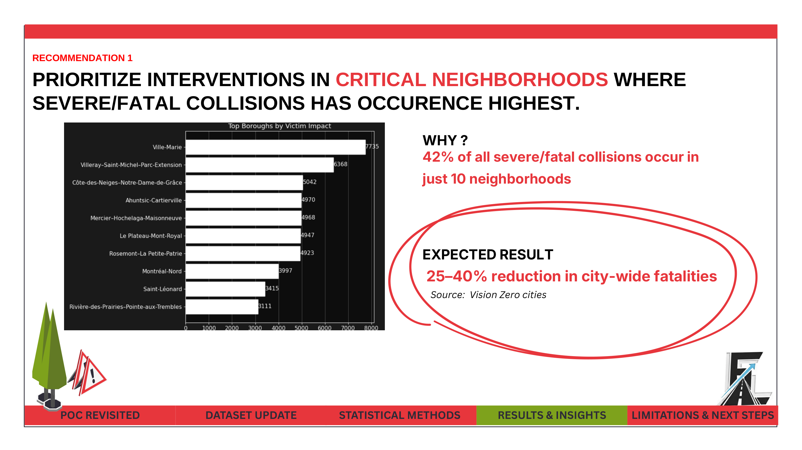
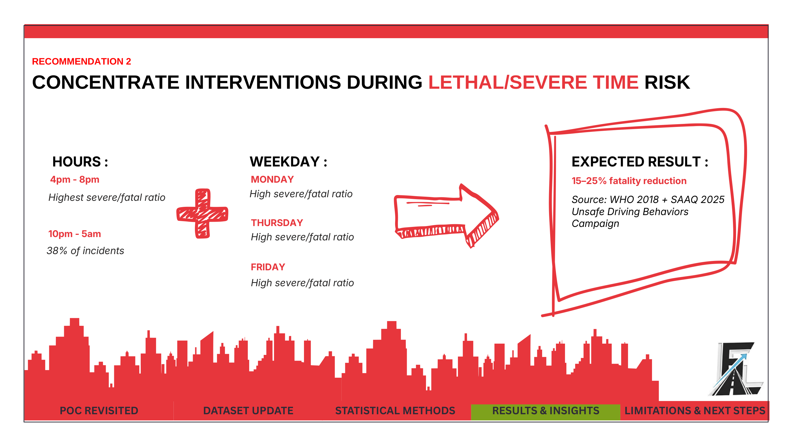
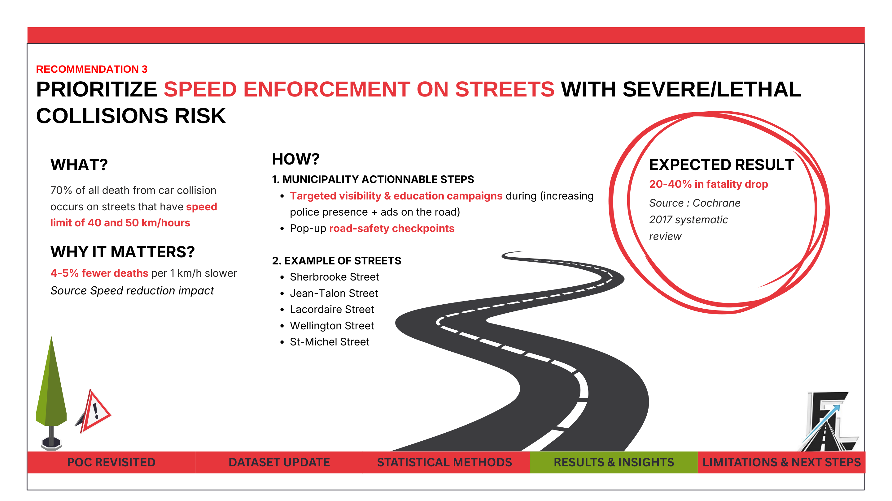
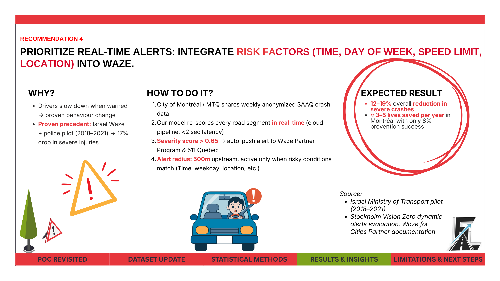
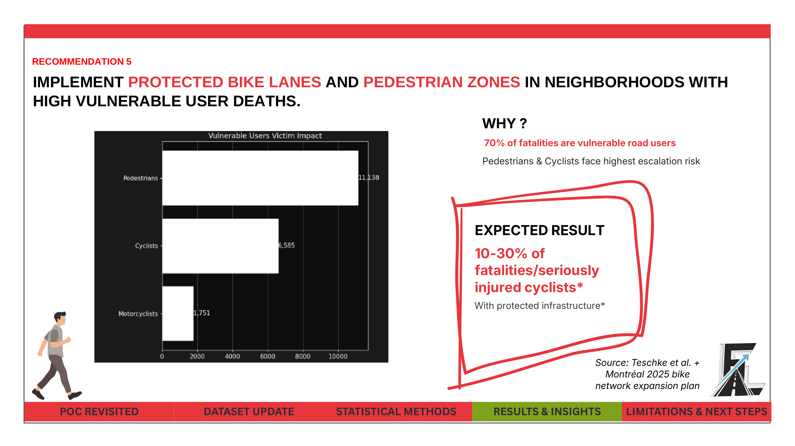

# Montreal Crash Risk (Machine Learning Portfolio Project)

## Problem Statement
Montréal road collisions are highly imbalanced: severe/fatal crashes are rare, but they drive the highest human and societal cost.

This project asks:

**How can we detect high-risk crash conditions early enough to prioritize prevention resources and reduce severe outcomes?**

## Executive Summary (Non-Technical)
This project built a recall-first machine learning pipeline to flag severe/fatal crash risk from pre-crash context (time, location, weather, road conditions). In the executed notebook results, the selected tuned Logistic Regression model reached **0.9398 recall** for severe/fatal events, making it suitable as an early-warning prioritization layer for policy and operations.

Detailed brief: `docs/executive_summary.md`

## Results
### 1. Predictive Performance
- Severe/fatal cases in modeled data: **2,049 (1.5617%)**.
- Final selected model: **Logistic Regression (Tuned GridSearchCV)**.
- Recall-first selection objective: maximize detection of rare severe/fatal events.

| Model | Stage | Accuracy | Precision | Recall | F1-score | ROC-AUC |
|---|---|---:|---:|---:|---:|---:|
| Logistic Regression | Baseline | 0.5508 | 0.0192 | 0.5528 | 0.0370 | 0.5715 |
| Decision Tree | Baseline | 0.9827 | 0.0145 | 0.0016 | 0.0029 | 0.5164 |
| Random Forest | Baseline | 0.9783 | 0.0123 | 0.0049 | 0.0070 | 0.5150 |
| XGBoost | Baseline | 0.9829 | 0.0161 | 0.0016 | 0.0030 | 0.5417 |
| Logistic Regression (Tuned) | Final selected | 0.0888 | 0.0159 | 0.9398 | 0.0312 | 0.5715 |

### 2. Key Modeling Insights
- Tuning improved Logistic Regression severe/fatal recall from **0.5528 → 0.9398**.
- Absolute recall gain: **+0.3870**.
- Relative recall lift: **+70.0%**.
- Cross-validation summary (from notebook outputs):
  - Accuracy: **0.5990 ± 0.0023**
  - Precision: **0.5909 ± 0.0023**
  - Recall: **0.6436 ± 0.0030**
  - F1-score: **0.6161 ± 0.0021**

### 3. Operational Findings
- Risk patterns concentrate by geography and time windows.
- Severe/fatal risk is strongly associated with location/context features.
- Outputs were translated into intervention recommendations for city and enforcement stakeholders.

Raw parsed outputs:
- `results/model_comparison.csv`
- `results/metrics_summary.json`

## Most Relevant Visual Evidence
### Core Model / Risk Figures


### Five Recommendation Slides (from Final Presentation)
Extracted from `reports/final-presentation.pdf`, pages **21–25**.







Full notebook output gallery: `docs/visual-gallery.md`

## ML Workflow


Technical detail: `docs/methodology.md`

## Repository Structure
```text
montreal-crash-risk/
├── README.md
├── requirements.txt
├── data/raw/
│   └── mtl-road-collision-dataset-2012-2021.csv
├── notebooks/
│   └── road_collisions_classification.ipynb
├── scripts/
│   ├── extract_notebook_images.py
│   ├── generate_results_summary.py
│   ├── extract_presentation_recommendation_slides.py
│   ├── build_visual_gallery.py
│   └── prepare_portfolio_assets.sh
├── assets/images/
│   ├── notebook/
│   └── presentation/
├── results/
│   ├── figure_manifest.csv
│   ├── metrics_summary.json
│   └── model_comparison.csv
├── docs/
│   ├── executive_summary.md
│   ├── methodology.md
│   └── visual-gallery.md
└── reports/
    ├── final-report.pdf
    ├── poc-report.pdf
    ├── final-presentation.pdf
    ├── dataset-dictionary.pdf
    └── rapports-accident-documentation.pdf
```

## Reproducibility / Example Runs
1. Install dependencies:
```bash
pip install -r requirements.txt
```
2. Rebuild portfolio visual and metric assets:
```bash
./scripts/prepare_portfolio_assets.sh
```
3. Quick checks:
```bash
ls results
ls assets/images/presentation
```

## Notes
- `notebooks/road_collisions_classification.ipynb` is preserved with executed outputs from the class workflow.
- Portfolio scripts package these outputs for GitHub display without rerunning full training.
