# Visual Gallery

This page shows all relevant figures extracted from executed outputs in `notebooks/road_collisions_classification.ipynb`.

The images are generated by `scripts/extract_notebook_images.py` and linked here automatically.

## Figure 01: Target severity distribution

## Figure 02: EDA multi-panel severity patterns

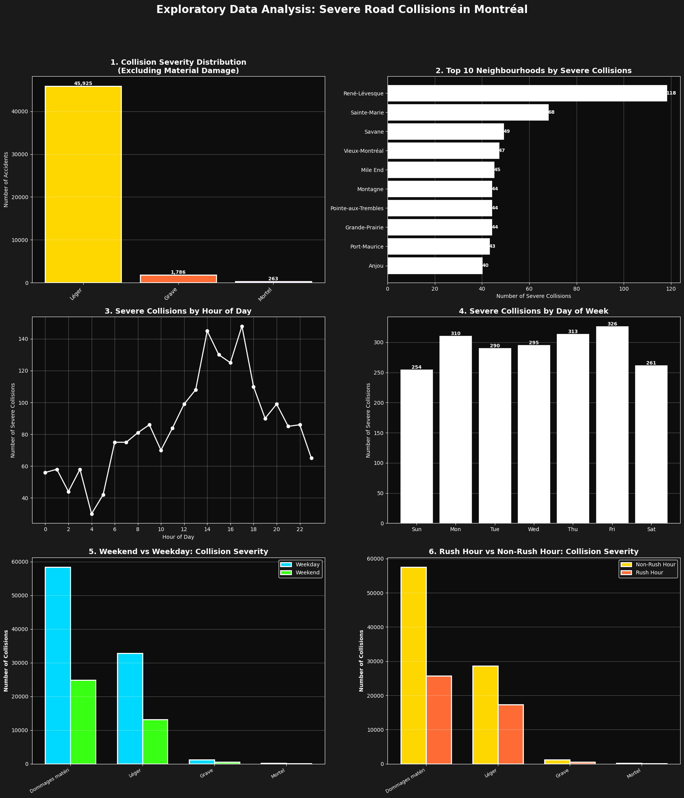

## Figure 03: Feature selection and ranking

## Figure 04: Baseline model comparison

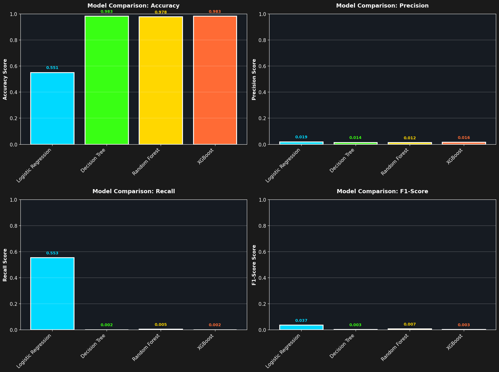

## Figure 05: Logistic regression tuning

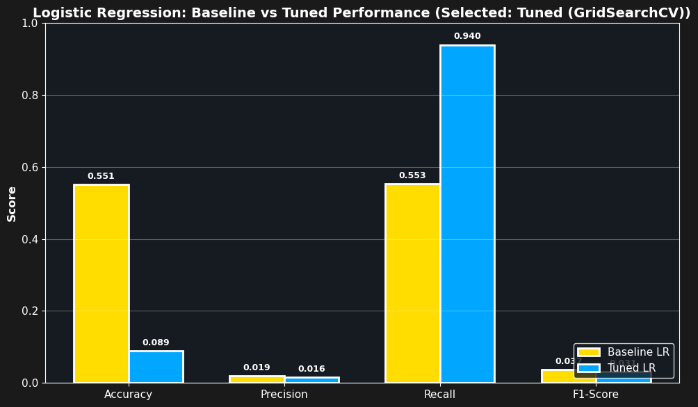

## Figure 06: Decision tree tuning

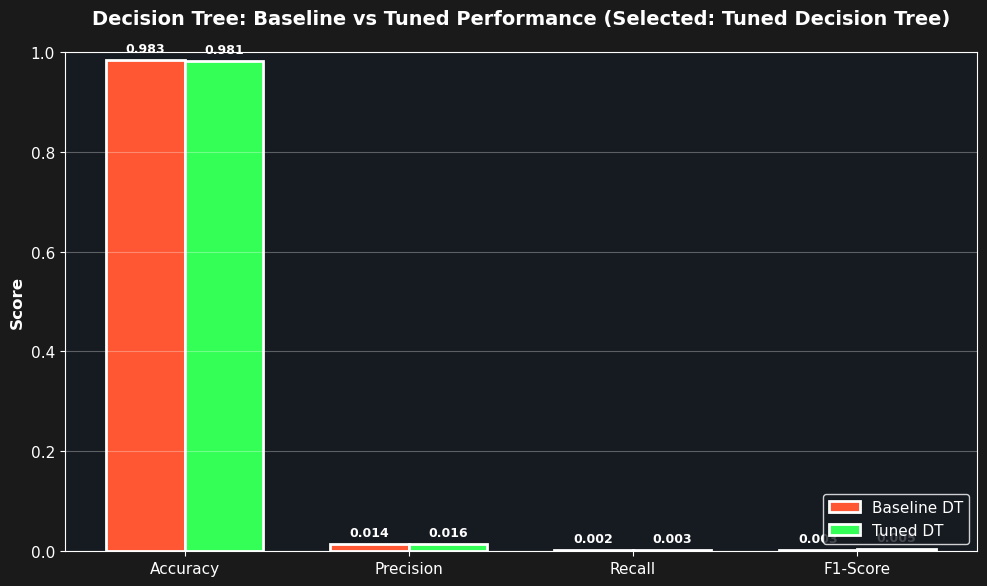

## Figure 07: Final model selection comparison

## Figure 08: Logistic regression coefficients

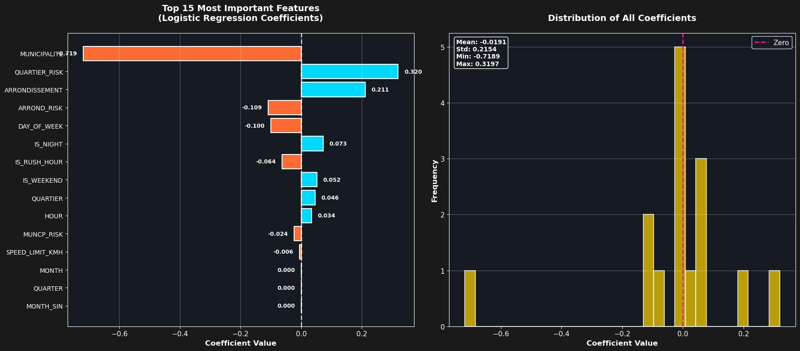

## Figure 09: SHAP feature importance

## Figure 10: Final model performance radar

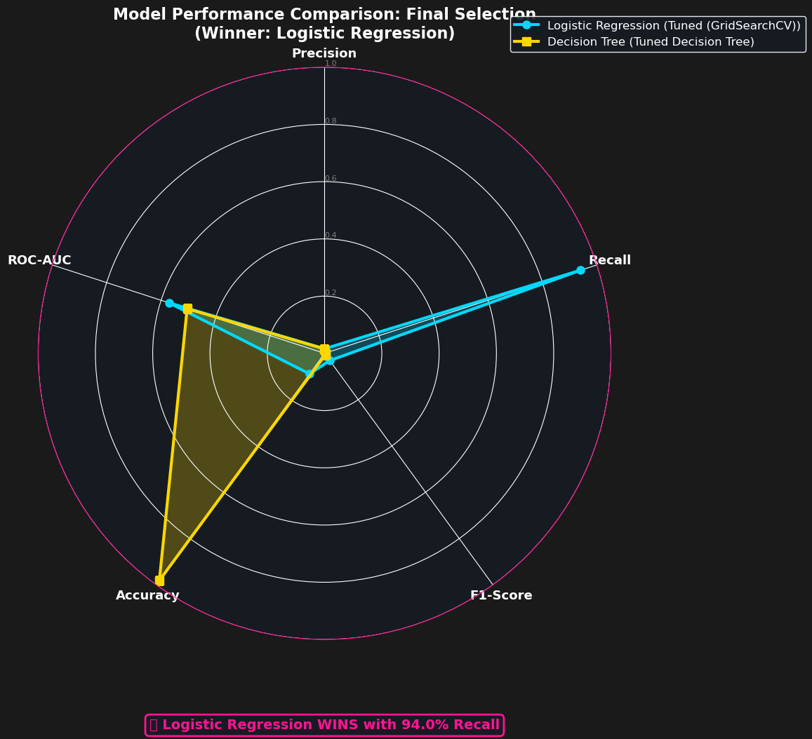

## Figure 11: Cross-validation stability

## Figure 12: Geographic risk analysis

## Figure 13: Collision class severity analysis

## Figure 14: Executive summary dashboard

## Figure 15: Recommendation 1 card

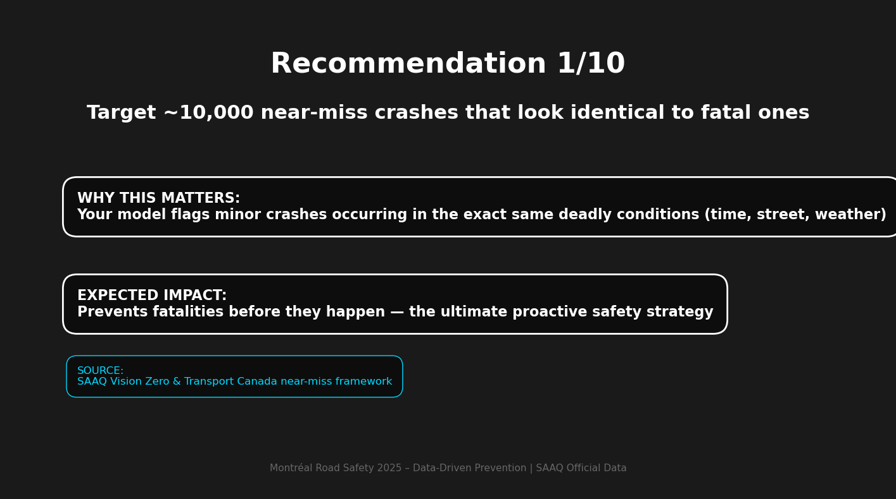

## Figure 16: Recommendation 2 card

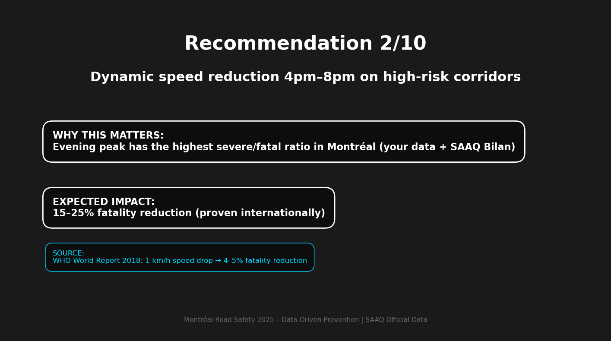

## Figure 17: Recommendation 3 card

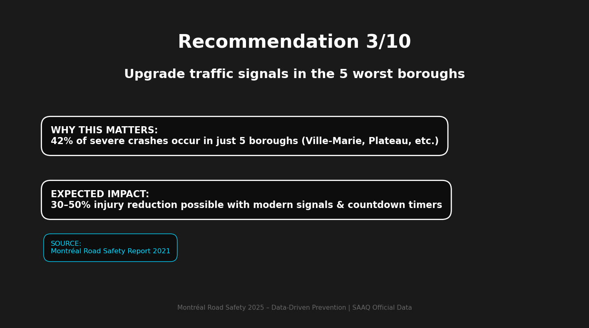

## Figure 18: Recommendation 4 card

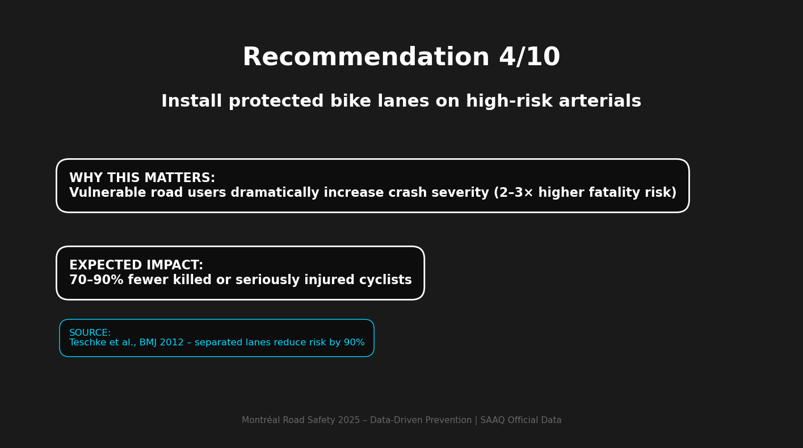

## Figure 19: Recommendation 5 card

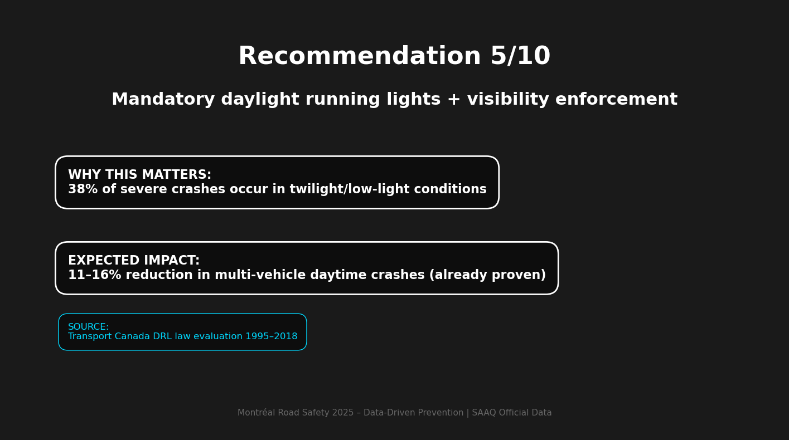

## Figure 20: Recommendation 6 card

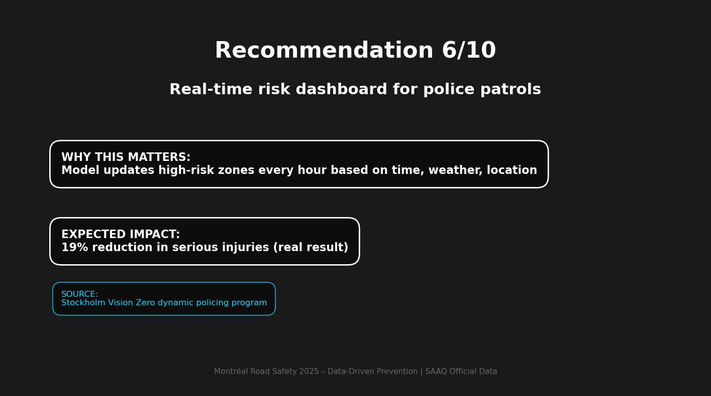

## Figure 21: Recommendation 7 card

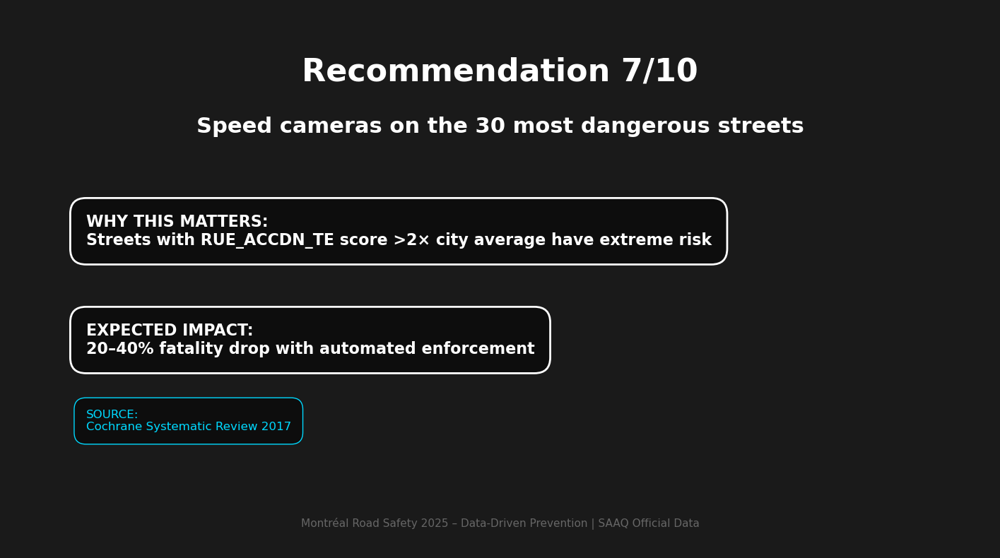

## Figure 22: Recommendation 8 card

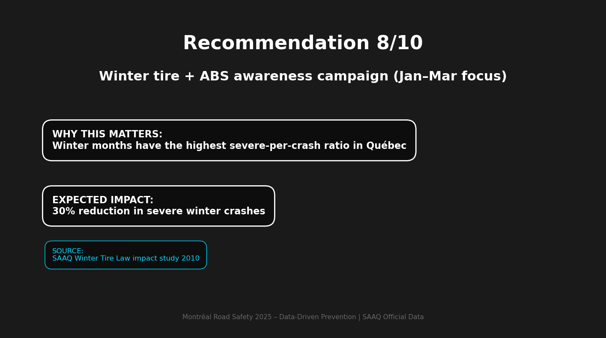

## Figure 23: Recommendation 9 card

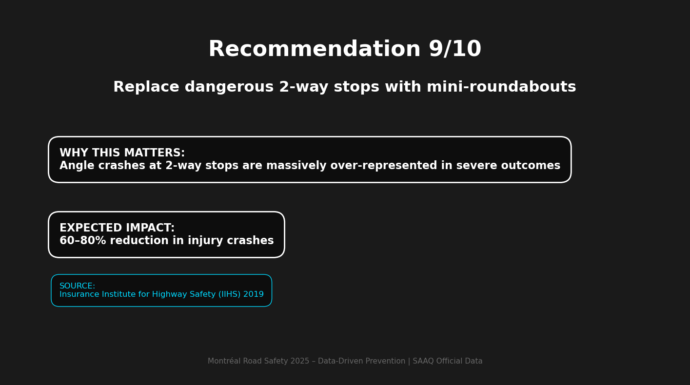

## Figure 24: Recommendation 10 card

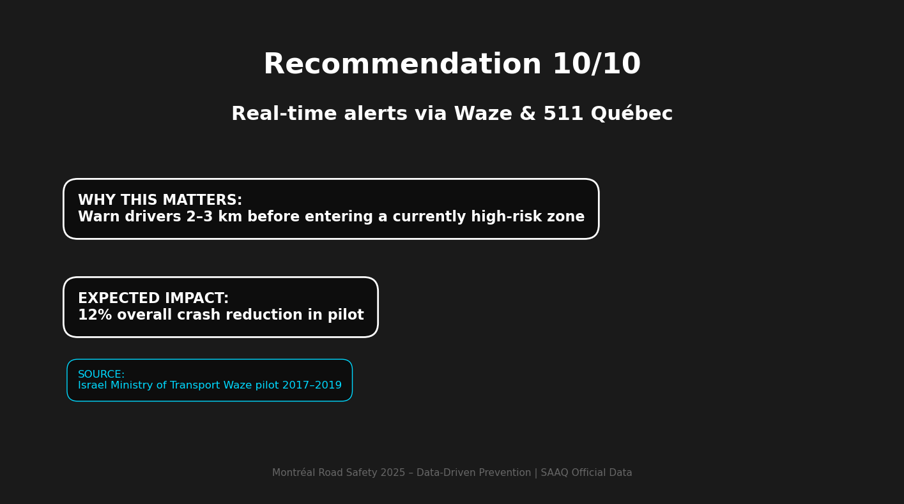
